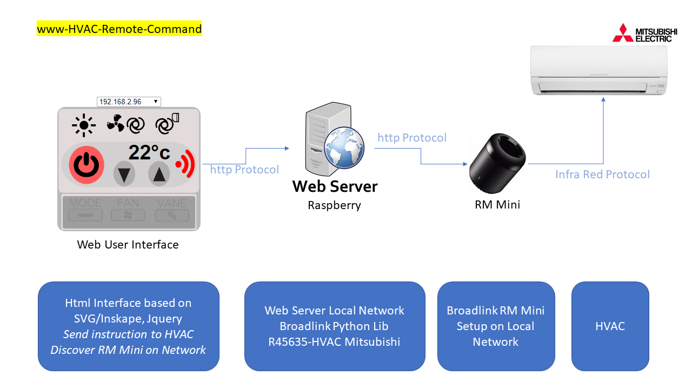

# www-HVAC-Remote-Control
Mitsubishi HVAC Remote Command Web Interface with full control through RM Mini device from Broadlink

## Getting Started

That web interface has been built in SVG using inkscape. A bunch of javascript has been added in order to reproduce a kind of original Mistusbishi IR Remote command behavior.

I've used my previous work on learning Mitsubishi HVAC protocol and have adapted to port ths information in regard of BroadLink IR protocol.
As the IR Mini device has a great wide (too much may be) range then this device is very usefull to control my HVACs.
It has been a little bit tricky to find a way to port the IR data packet to an understable packet for the BroadLink but finally it works ! I did my best to use python, providing a simple file that can be reused for other purpose.
I did not port all features discovered in the HVAC Mitsubishi protocol but key functions for my own purpose.

In addition I've designed a web interface to faciliate the use from a web interface, including a discovery function helping to indentify RM Mini present on the network.

### Installing

You have to install Python Broadlink library in your system.
Make sure that Search.py and SendHVACCmdToRM2.py have a +x Execution attribute. You should try to launch this file manually in order to confirm that the system is setup correctly.

Exemple of Good Ouput from Search.py
>./Search.py
>{ "success" : 1, "data" : [ {"Device_Id" : 1,"Type" : "RM2","Host_IP" : "192.168.2.107", "Host_Port" : " 80", "Host_MAC" : "780f77183d70"}, {"Device_Id" : 2,"Type" : "RM2","Host_IP" : "192.168.2.100", "Host_Port" : " 80", "Host_MAC" : "780f7700dd33"}, {"Device_Id" : 3,"Type" : "RM2","Host_IP" : "192.168.2.96", "Host_Port" : " 80", "Host_MAC" : "34ea348a35ee"}]}

Exemple of Good Ouput from Search.py
>./SendHVACCmdToRM2.py
>RUN=OK

### Information on SendHVACCmdToRM2.py commands line
The SendHVACCmdToRM2.py commands line are described below:
>usage: SendHVACCmdToRM2.py [-h] [-t HVAC_TEMPERATURE] [-p]
>                           [-c HVAC_CLIMATE_CODE] [-Vv HVAC_VANNE_V_CODE]
>                           [-F HVAC_FAN_MODE] [-host HVAC_HOST]
>                           [-mac HVAC_MAC] [--version]

## Global Network overview

Enjoy !
-r45635
